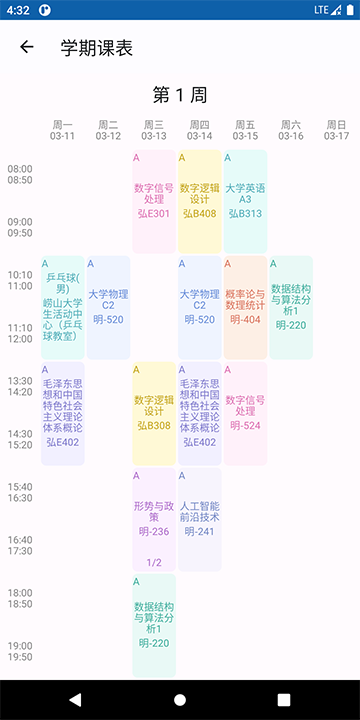
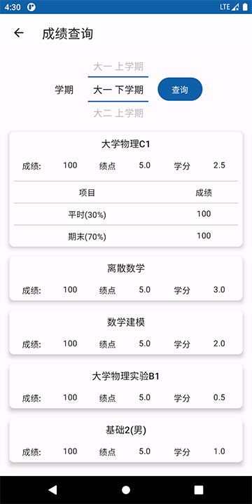
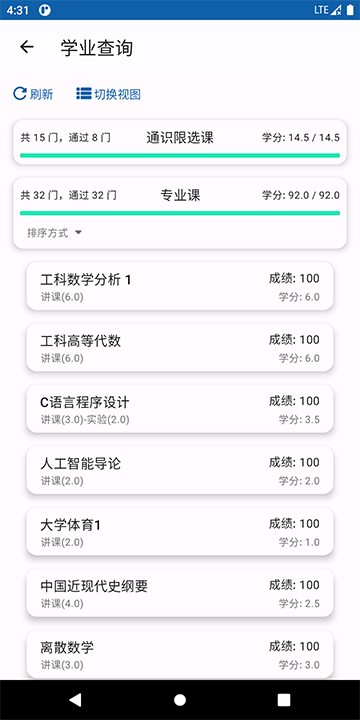

  </a>

# 青科助手

✨ 一款集教务查询和课表管理于一体的移动端软件 ✨

  
  

### 简介 📃

- Qust Helper 是一款移动端教务系统客户端，旨在为师生提供一个便捷的教务访问方式，随时随地查看课程安排、考试成绩、教务通知等信息。
- Qust Helper 还是一款优秀的课表软件，能够轻松从教务导入课程信息，自动生成个性化的课表。
- 基于全新的 Jetpack Compose 架构，拥有更加出色的用户体验。*后续可能支持多平台*。

### 应用截图📸

  

### 功能实现 💻

- [x] 教务课表导入
- [x] 成绩查询
- [x] 学业情况查询
- [x] 考试查询
- [x] 教务通知推送
- [x] 成绩推送

### 更新日志 🔖

#### V3.0 Alpha

1. 基于Jetpack Compose完全重构，部分功能持续更新中
