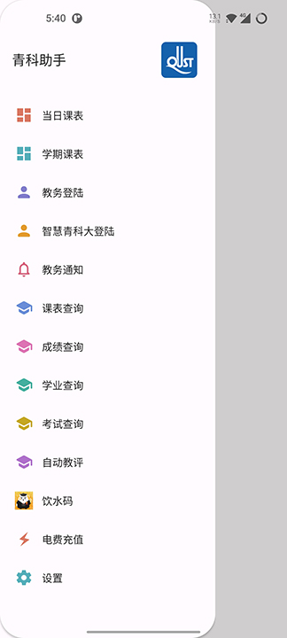
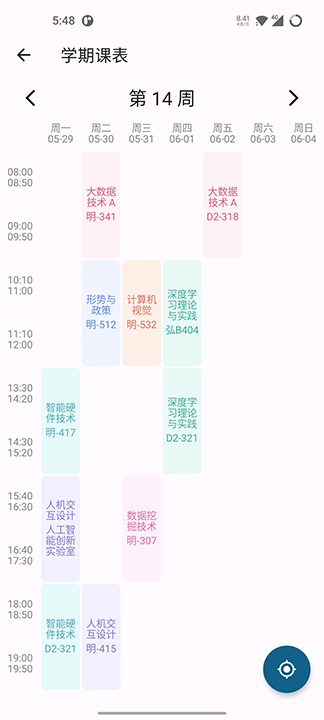
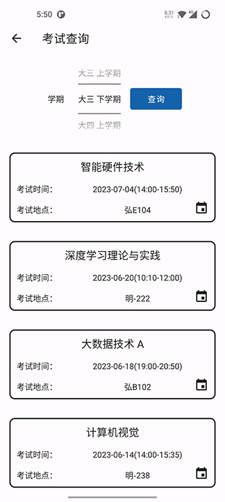

  </a>

# 青科助手

✨ 青岛科技大学-教务系统APP ✨

  
  

### 功能简介 📃

- 丢弃繁重的QUSB教务系统,实现APP登录查询

  

### 功能实现 💻

- [ ] 考试信息添加到课表
- [ ] 不同课程标志
- [ ] 多课表支持
- [ ] 课表上课提醒
- [ ] 自动查询课表
- [ ] 自动评教添加批量教评
- [ ] 桌面小部件新增周课表，饮水码
- [x] 考试信息同步到日历
- [x] 教务通知推送
- [x] 成绩推送
- [x] 课表锁定
- [x] 暗色模式开关
- [x] 设置新增隐藏教师功能

### 更新日志 🔖

#### V2.4.2

1. 课表查询支持保留自定义的课程
2. 更新渠道新增Gitee更新渠道
3. 修复单双周解析异常的bug
4. 修复课表编辑功能异常的bug
5. 修复设置课程时间不生效的bug